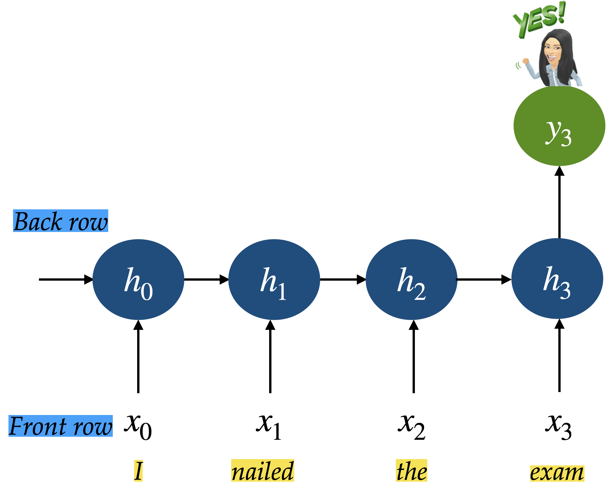

# Examples of embodied activities from our courses.

This document shows some examples of embodied activities from our courses.

### RNN Activity

[source](https://ubc-mds.github.io/DSCI_575_adv-mach-learn/lectures/notes/05_intro-to-RNNs.html#rnns-introduction)

RNN is like your brain reading a sentence word by word.

- **Input at each time step**: The current word you read
- **Hidden state**: Your current mental understanding
- **Output**: Your interpretation, reaction, or prediction at that point in time

Two rows of students:

- Front row = input layer (observations at each time step)
- Back row = hidden state at each time step
- Each column is a time step (0 through 4)
- So we'll have 4 front-row students: $x_0$ to $x_3$
- And 4 back-row students: $h_0$ to $h_3$

1. At time step 0:
   - Front-row student $x_0$ gets a word
   - They pass it to the back-row student behind them ($h_0$).
   - $h_0$ is initialized with an image if you want to make it interesting
2. At time step 1 (and beyond):
   - The front-row student (e.g., $x_1$) gets a new word
   - The back-row student (e.g., $h_1$) receives:
     - The current input from the front-row student (e.g., $x_1$)
     - Whatever "memory" is passed from the previous hidden state (e.g., $h_0$)
     - $h_1$ combines this (e.g., by writing a summary phrase or combining keywords).
3. Repeat until time step 3 or 4.
4. Final time step: $h_3$ summarizes what they remember (e.g., predicts next word, gives the "mood" of the sentence, etc.)

### Markov Models of Language Activity

[Source](https://ubc-mds.github.io/DSCI_575_adv-mach-learn/lectures/notes/01_Markov-models.html#examples-of-markov-chains)

Each of you will receive a sticky note with a word on it. Here's what you'll do:

- **Carefully remove the sticky note to see the word**. This word is for your eyes only; don't show it to your neighbours!

- Think quickly: what word would logically follow the word on the sticky note? **Write this next word on a new sticky note**. You have about 20 seconds for this step, so trust your instincts!

- **Pass your predicted word to the person next to you**. Do not pass the word you received from your neighbour forward. Keep the chain going!

- Stop after the last person in your row/table has finished.

- Each row/table reads their generated sentence.

Whichever row generates the most captivating sentence will get XXX.

Here are some example sentences generated by students.

- Row 1: We trust God is student study Hard Rock Johnson buys candy
- Row 2: Is student study hard rock johnson buys candy
- Row 3: Data center tendency increase fluctuation during afternoon tea party invitation acceptance
- Row 4: The size of candy sweet pudding gross grossy yard fence (??????) 😀
- Row 5: We play games are mingle cuddle pet cat licking ice cream with you eat.
- Row 6: What are you talking about?
- Row 7: I like to eat ramen spicy story time series in the game time off
